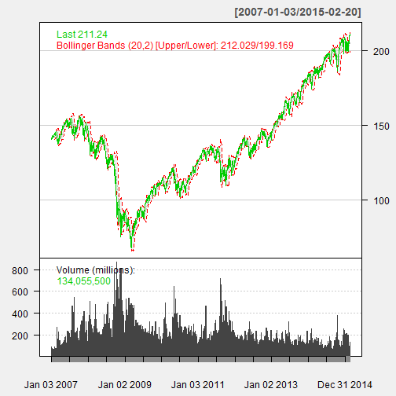

## Stock Dashboard
The Stock Dashboard is intended for education purposes only. It is not intended to make any recommendations on stocks to purchase or sell.

The dashboard is a simply reactive ShinyApp showing data about S&P 500 stocks.

---

## How it works
The app leverages the standard ui.R and server.R files as well as using helpers.R and makes use of the quantmod library for accessing stock data.

By entering in a stock symbol and selecting dates the chart will update with relevant information. You can also see the raw data by clicking on the Data Explorer tab.

---

## Sample Chart
This is a chart summarizing the S&P 500, similar to what you would see in the Dashboard.

 

---

## Future
The Dashboard is a quick way to see valuable stock data. Future goals would be to add a live feed of the stock data rather than just having the historical data.

---

